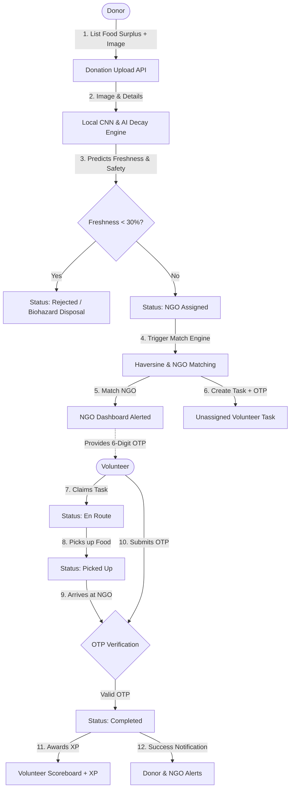
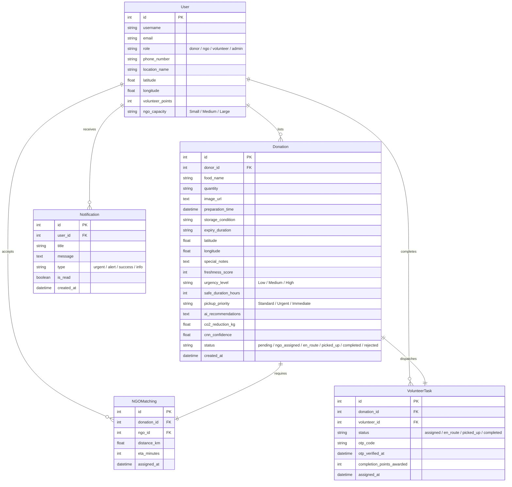

# 🥦 Smart Food Network (SFN)
> **An AI-powered, real-time food surplus rescue and distribution platform.** SFN bridges the gap between food donors (restaurants, hotels, events), local NGOs, and volunteer dispatch couriers. The platform optimizes surplus redistribution, prevents food waste, minimizes CO₂ footprints, and uses game mechanics to incentivize community rescue operations.

---

## 🚀 Key Modules & Technical Pillars

1. **🧠 AI-Powered Freshness & Safety Analytics**
   - **Local CNN Engine**: Implements a simulated/real MobileNetV2 image classification network (using TensorFlow CPU) that analyzes uploaded food photos for visual mold signatures, olive/greenish-gray decay, or fuzzy gray fuzz.
   - **Physical Time-Decay Simulation**: Automatically calculates exponential freshness decay on the backend based on preparation time, storage condition (Ambient, Hot Box, Refrigerated, Frozen), and estimated expiry. Ambient storage decays **15x faster** than frozen!
   - **Carbon Impact Estimation**: Automatically computes the CO₂ emissions saved (in kg) for every successful rescue to quantify environmental impact.

2. **📍 Geolocation-Based Dynamic Matching**
   - **Haversine Distance Matching**: A high-efficiency algorithm that matches food listings with the closest suitable NGO.
   - **Multi-Factor Priority Scoring**: Weights the distance by the urgency level of the donation (e.g., High-urgency listings are routed to the absolute closest NGO, while Low-urgency listings are routed to NGOs with higher capacity or slightly further away).

3. **🔒 Secure Handshake & Verification Loop**
   - **Unique OTP Generation**: At matching, a secure 6-digit verification code is generated for the volunteer task.
   - **Delivery Authentication**: The volunteer must physically hand over the food to the NGO, acquire the OTP from the NGO dashboard, and verify it on their app to mark the rescue as **Completed**.

4. **🏆 Gamified Volunteer Incentives**
   - **XP & Leaderboards**: Volunteers earn completion points (e.g., +40, +50, +60, +80 XP) upon successful delivery.
   - **Tiered Badges**: Ranks volunteers dynamically as *🥇 Grandmaster Rescuer*, *🥈 Veteran Ranger*, or *🥉 Champion* based on leaderboard standings.

5. **📊 Admin command Center (Control Tower)**
   - **Live Analytics**: Real-time metrics on total meals saved, carbon footprint reduction, active rescues, and participating NGOs/volunteers.
   - **Weekly Timelines & Distributions**: Category breakdowns (Cooked Hot Meals, Bakeries & Grains, Groceries, etc.) and weekly timelines using interactive chart visualizations.
   - **Live Regional Hotspot Maps**: Simulates real-time geospatial hotspots showing where donations are originating, their status, and urgency levels.

---

## 🗺️ System Architecture Flow

The flowchart below displays how data flows through the Smart Food Network from surplus listing creation to successful delivery:



---

## 🗄️ Database Schema

The database relies on a clean, relational schema using Django’s ORM (SQLite for local development, PostgreSQL ready):



---

## 🔌 API Endpoints Reference

All paths are prefixed with `/api`.

### 🔑 Authentication & Profiles
| Method | Endpoint | Access | Description |
| :--- | :--- | :--- | :--- |
| `POST` | `/auth/login/` | Public | Obtains JWT Access & Refresh Tokens + User Profile. |
| `POST` | `/auth/register/` | Public | Registers a new user (Donor, NGO, Volunteer). |
| `POST` | `/auth/token/refresh/` | Public | Refreshes expired JWT Access tokens. |
| `GET` | `/auth/profile/` | Authenticated | Gets the active user's details. |

### 🥦 Food Surplus & NGO Matching
| Method | Endpoint | Access | Description |
| :--- | :--- | :--- | :--- |
| `POST` | `/donations/upload/` | Donor/Admin | Uploads surplus, triggers CNN/AI Quality inspection, runs dynamic NGO matching. |
| `GET` | `/donations/my/` | Donor/Admin | Retrieves all surplus listings uploaded by the active Donor. |
| `GET` | `/ngo/incoming/` | NGO/Admin | Gets active matches and related delivery task states for the logged-in NGO. |

### 🚚 Volunteer Operations
| Method | Endpoint | Access | Description |
| :--- | :--- | :--- | :--- |
| `GET` | `/volunteer/tasks/` | Volunteer/Admin | Lists available unassigned tasks and active claimed tasks. |
| `POST` | `/volunteer/tasks/<id>/claim/` | Volunteer/Admin | Claims an unassigned task and sets the status to `en_route`. |
| `POST` | `/volunteer/tasks/<id>/status/` | Volunteer/Admin | Updates travel state (`en_route` ➔ `picked_up`). |
| `POST` | `/volunteer/tasks/<id>/verify-otp/` | Volunteer/Admin | Authenticates security OTP code from the NGO to mark delivery `completed` and awards points. |

### 📊 Notifications & Platform Analytics
| Method | Endpoint | Access | Description |
| :--- | :--- | :--- | :--- |
| `GET` | `/notifications/` | Authenticated | Fetches the recent 20 user notifications. |
| `POST` | `/notifications/` | Authenticated | Marks all notifications of the user as read. |
| `GET` | `/analytics/dashboard/` | Authenticated | Feeds the Admin Command Center with real-time geospatial hotspots, timeline, scoreboard, and chart metrics. |

---

## 🛠️ Step-by-Step Installation & Setup

Follow these steps to run the Smart Food Network application locally.

### 📦 Prerequisites
- **Python 3.9 - 3.11** (Installed and added to path)
- **Node.js 18+ & npm** (Installed and added to path)

---

### 🎛️ Backend Setup

1. **Navigate to the backend directory**:
   ```bash
   cd backend
   ```

2. **Create a virtual environment & activate it**:
   - **Windows PowerShell**:
     ```powershell
     python -m venv venv
     .\venv\Scripts\Activate.ps1
     ```
   - **macOS/Linux**:
     ```bash
     python3 -m venv venv
     source venv/bin/activate
     ```

3. **Install dependencies**:
   ```bash
   pip install -r requirements.txt
   ```

4. **Initialize database & Seed mock data**:
   We have included a unified reset and seed script (`reset_and_seed.py`) that clears existing database structures, applies migrations, and sets up working accounts for each user role:
   ```bash
   python reset_and_seed.py
   ```

5. **Start the Django Development Server**:
   ```bash
   python manage.py runserver
   ```
   The backend server will run on `http://127.0.0.1:8000/`.

---

### 💻 Frontend Setup

1. **Navigate to the frontend directory**:
   ```bash
   cd ../frontend
   ```

2. **Install node packages**:
   ```bash
   npm install
   ```

3. **Start the Vite development server**:
   ```bash
   npm run dev
   ```
   The frontend app will launch at `http://localhost:5173/` or similar local URL. Open this in your browser.

---

## 🔑 Demo Seeded Accounts

For testing the complete lifecycle (Donor listing ➔ NGO assigned ➔ Volunteer claiming ➔ OTP verification), use the following accounts (all share the same password):

| Username | Role | Purpose | Default Location |
| :--- | :--- | :--- | :--- |
| **`admin`** | Admin | Full control, interactive charts, global map hotspots | Central Command |
| **`donor`** | Donor | Lists surplus, views AI freshness scores, sees maps | Indiranagar |
| **`cmcafe`** | Donor | Secondary donor for testing alternative locations | Indiranagar Café |
| **`oldagehomengo`**| NGO | Accepts matches, views delivery status, provides verification OTP | Malleshwaram |
| **`agaashram`** | NGO | Secondary NGO (Large capacity) | Malleshwaram North |
| **`gollal`** | Volunteer | Claims rescues, changes status, enters OTP to earn points | MG Road |
| **`gollalmanasunagi`** | Volunteer | Secondary volunteer for claims testing | MG Road Hub |

**🔑 Password for all seeded accounts**: `password123`

---

## 📈 Verification Checklist for Evaluators

To test the application end-to-end:
1. **Login as `donor`** ➔ List a food item (e.g. "Veg Curry, 10 Meals", Prepared "Just Now", Storage "Ambient", Expiry "4 Hours"). Click **Upload**.
2. **Observe AI Analysis** ➔ Observe the immediate AI Freshness Index, CNN classification confidence, and CO₂ savings calculations. SFN's matching engine automatically assigns the nearest NGO (`oldagehomengo` or similar).
3. **Login as `oldagehomengo`** (NGO) ➔ View the **Incoming Rescue Operations** list. Take note of the dynamic ETA, distance, and the generated **6-digit verification OTP code**.
4. **Login as `gollal`** (Volunteer) ➔ View the **Available Claims Map/List**. Click **Claim Rescue** on the newly listed task.
5. **Update Delivery Progress** ➔ Change the status from `Assigned` to `En Route` and then `Picked Up`.
6. **Complete Delivery & Award Points** ➔ Submit the 6-digit OTP code copied from the NGO dashboard. The task resolves to **Completed**, adding points to your volunteer XP and updating the live global leaderboard.
7. **Login as `admin`** ➔ Open the **Admin Command Center** to see the updated global metrics, live map hotspots, category chart distributions, and leaderboards!

---

💡 *Built with ❤️ for the Smart Food Network Community.*
